<div align="center">

# 🎓 EduTest Pro

**Офлайн-система тестирования для учебных аудиторий**
с прокторингом, подписанными авто-обновлениями и нулевой зависимостью от интернета.

[](https://github.com/uiper123/tgtgtess/releases/latest)
[](https://github.com/uiper123/tgtgtess/actions/workflows/ci.yml)
[](LICENSE)
[](pyproject.toml)

<sub>Бывшее имя: <strong>TTGTiSO-Test</strong></sub>

</div>

---

## ✨ Что это?

EduTest Pro — настольный комплекс для проведения экзаменов / контрольных в учебных аудиториях. Сервер у преподавателя, клиент-киоск у каждого студента, всё в локальной сети.

**Никакого интернета. Никакого Moodle. Никакой облачной зависимости.**

- 🖥 **Сервер преподавателя** — управление, мониторинг, аналитика, экспорт CSV.
- 🎓 **Клиент-киоск студента** — полноэкранный, с защитой от переключения окон.
- 🔐 **Авто-обновления с Ed25519-подписью** (с v1.4.0) — гарантия что никто в сети не подсунет студенту вредоносный exe.
- 📡 **TCP/JSON-протокол** на порту 9876, всё в LAN.
- 🛡 **Прокторинг** — учёт нарушений, конфигурируемый лимит, авто-блокировка попыток списать.

---

## 📥 Скачать

Готовые сборки лежат в [Releases](https://github.com/uiper123/tgtgtess/releases/latest):

| Платформа | Серверная сборка | Клиентская сборка |
|---|---|---|
| 🪟 Windows 10/11 | `TTGTiSO-Test-server-vX.Y.Z.exe` | `TTGTiSO-Test-student-vX.Y.Z.exe` или `EduTestStudent_Setup.exe` (инсталлер) |
| 🐧 Linux (Ubuntu 20.04+) | `TTGTiSO-Test-server-vX.Y.Z` | `TTGTiSO-Test-student-vX.Y.Z` |

> Зависимостей в системе ставить не нужно — Nuitka собирает всё в один файл.

---

## 🚀 Быстрый старт (за 3 минуты)

### 1. Преподаватель — сервер

1. Скачайте `TTGTiSO-Test-server-vX.Y.Z.exe` из последнего релиза.
2. Запустите. Сервер автоматически слушает TCP порт **9876**.
3. Импортируйте `.txt`-файл с вопросами (формат см. ниже).
4. На вкладке **«Запуск тестирования»** выберите группу, длительность, лимит нарушений → нажмите «Запустить».

### 2. Студент — клиент

1. Скачайте `TTGTiSO-Test-student-vX.Y.Z.exe`.
2. Запустите. На login-экране введите **ФИО**, **группу** и **IP сервера**.
3. Готово — клиент перейдёт в киоск-режим, начнёт тест и засчитает результат.

### 3. Преподаватель — результаты

После теста результаты доступны на вкладке **«Результаты студентов»**. Экспорт в CSV в один клик.

---

## 📸 Скриншоты

### Сервер преподавателя

<table>
  <tr>
    <td align="center" width="50%"><b>Дашборд — список тестов</b></td>
    <td align="center" width="50%"><b>Список вопросов <sub>(новый фильтр)</sub></b></td>
  </tr>
  <tr>
    <td>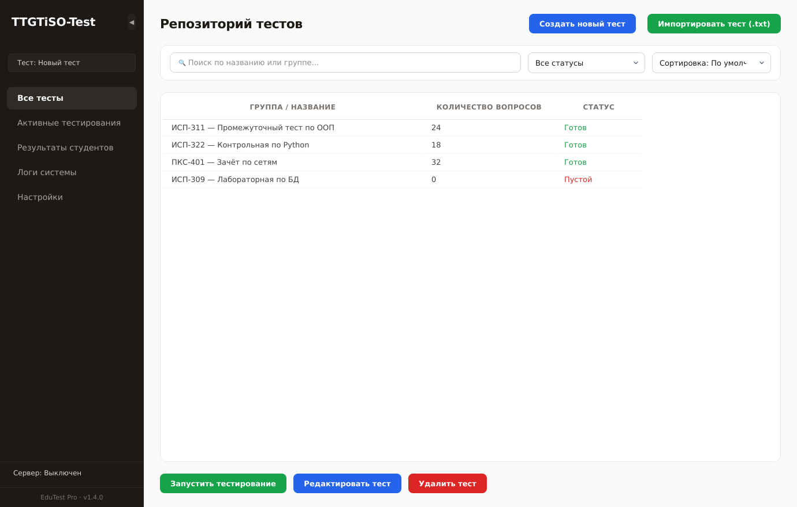</td>
    <td>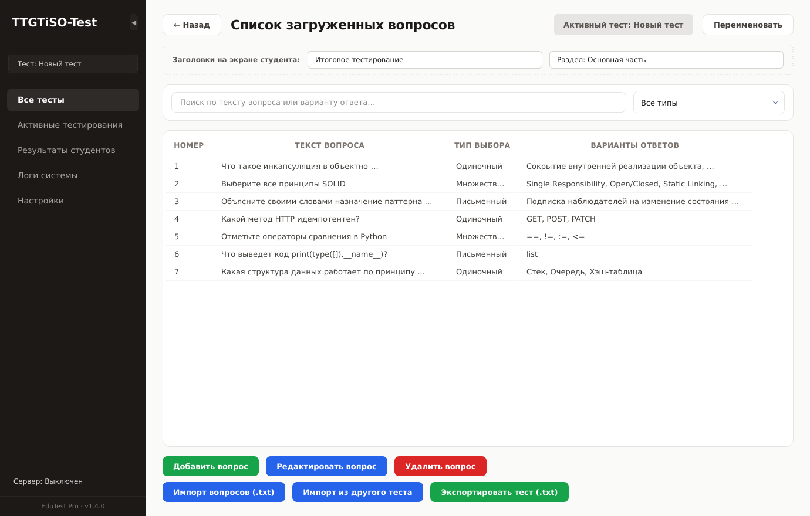</td>
  </tr>
  <tr>
    <td align="center"><b>Активные тестирования</b></td>
    <td align="center"><b>Результаты студентов</b></td>
  </tr>
  <tr>
    <td>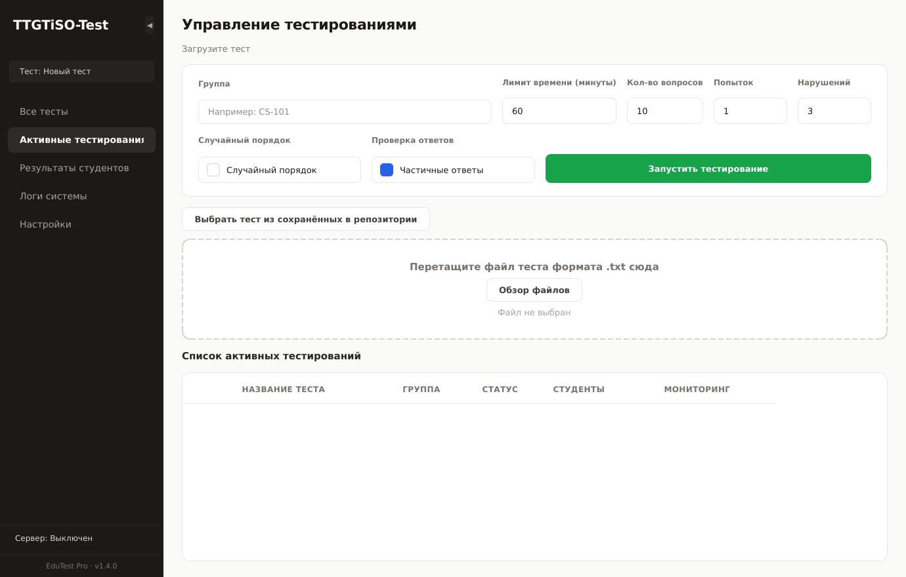</td>
    <td>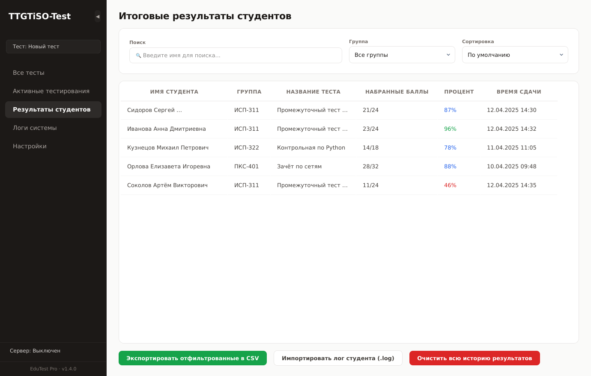</td>
  </tr>
  <tr>
    <td align="center"><b>Логи <sub>(новый фильтр по уровню)</sub></b></td>
    <td align="center"><b>Логи — выбран фильтр «Ошибки»</b></td>
  </tr>
  <tr>
    <td>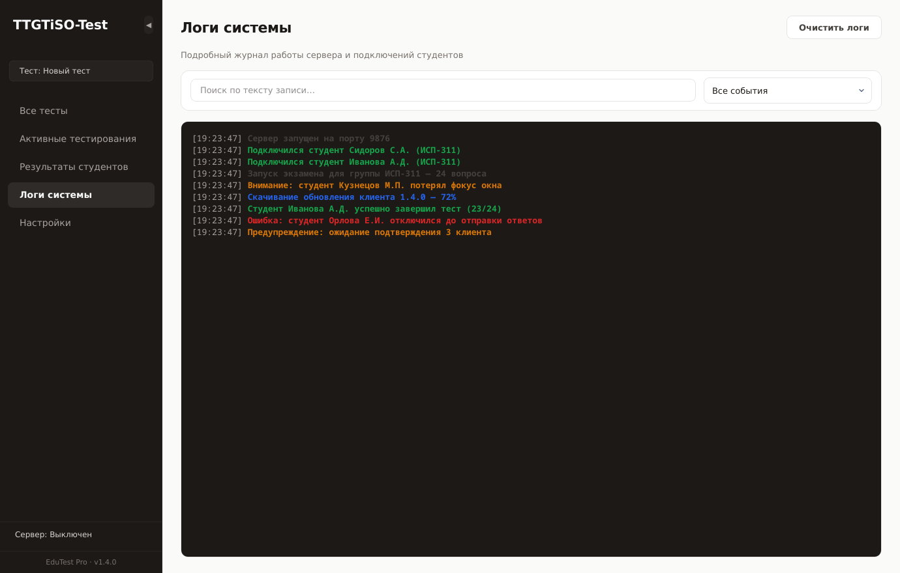</td>
    <td>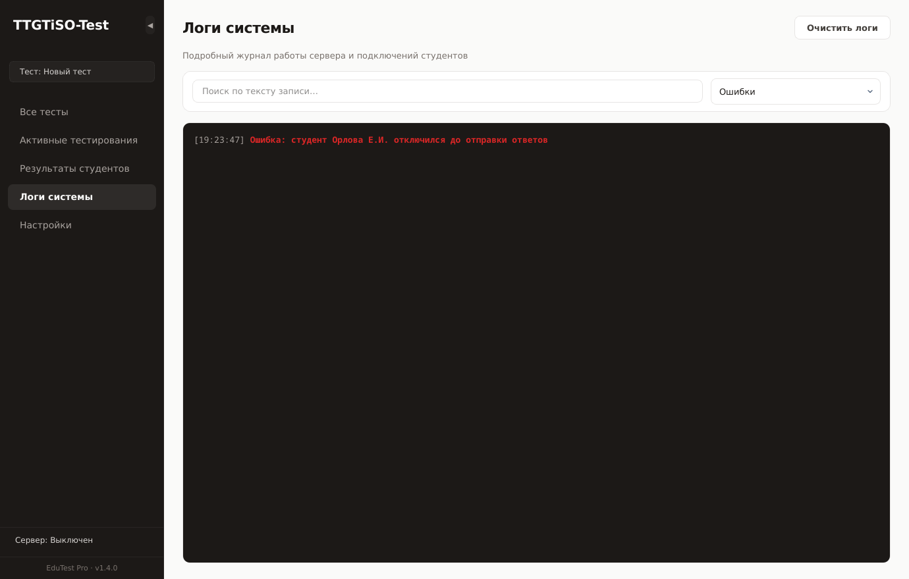</td>
  </tr>
  <tr>
    <td align="center"><b>Настройки</b></td>
    <td align="center"><b>Редактирование вопроса</b></td>
  </tr>
  <tr>
    <td>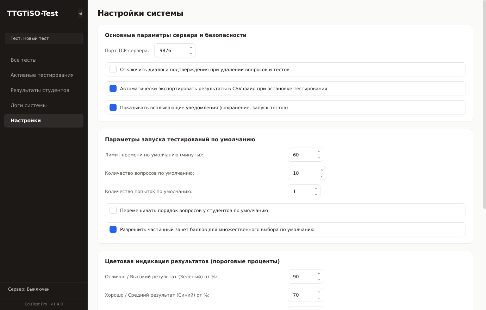</td>
    <td>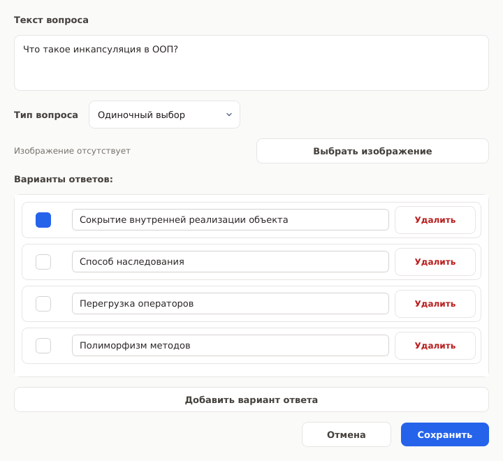</td>
  </tr>
  <tr>
    <td align="center" colspan="2"><b>Мониторинг тестирования в реальном времени</b></td>
  </tr>
  <tr>
    <td colspan="2">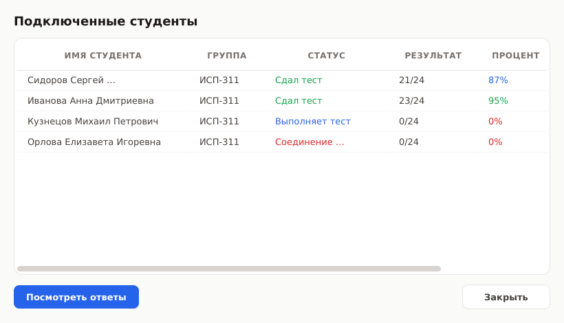</td>
  </tr>
</table>

### Клиент-киоск студента

<table>
  <tr>
    <td align="center" width="50%"><b>Подключение к серверу</b></td>
    <td align="center" width="50%"><b>Прохождение теста</b></td>
  </tr>
  <tr>
    <td>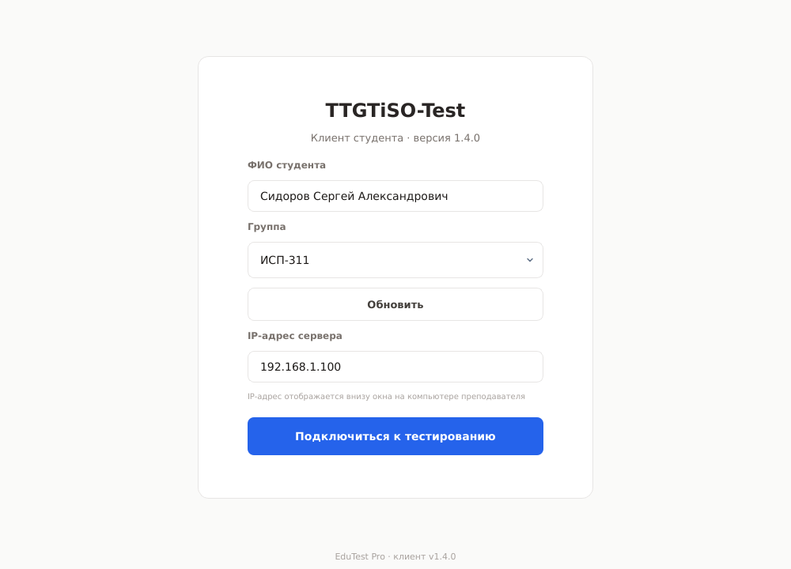</td>
    <td>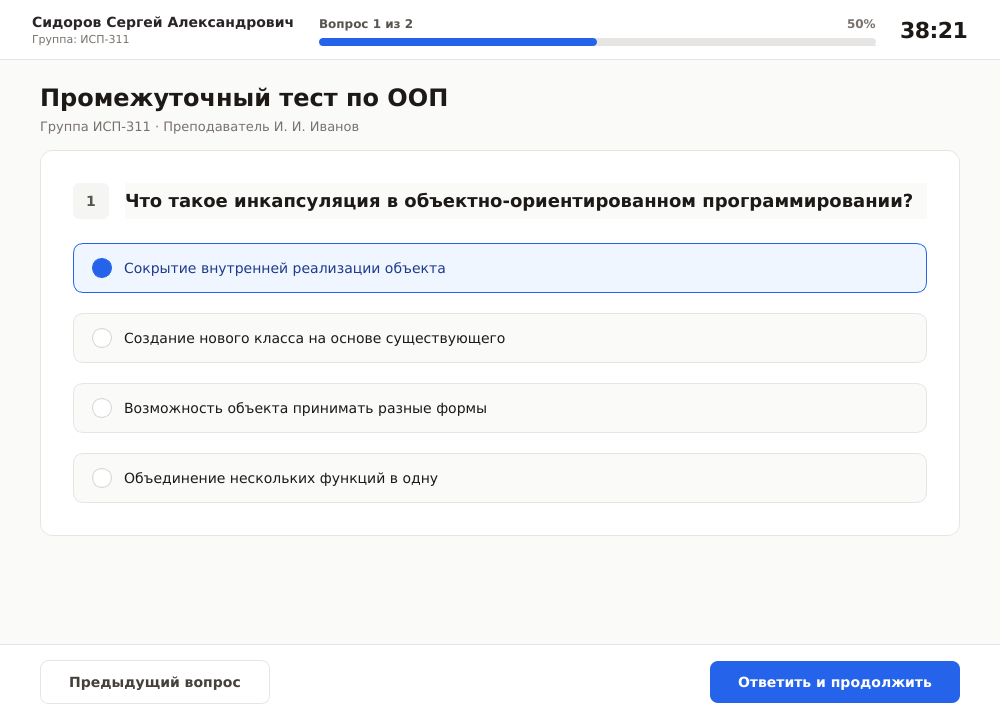</td>
  </tr>
  <tr>
    <td align="center" colspan="2"><b>Экран результата</b></td>
  </tr>
  <tr>
    <td colspan="2" align="center">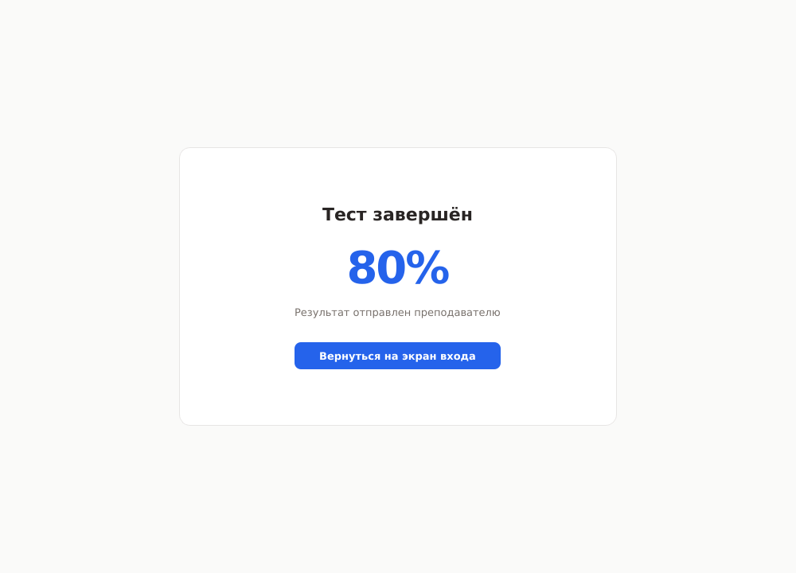</td>
  </tr>
</table>

---

## 🎨 Что нового в дизайне v1.4.0

Полный редизайн UI — без градиентов, без декоративных кнопок, с единой плоской дизайн-системой.

**Дизайн-токены**
- Палитра — тёплые stone-нейтрали + единственный спокойный акцент **blue-600** `#2563eb`
- Сайдбар в угольном `#1c1917`, активная навигация — только мягкой подсветкой (без полосок-индикаторов)
- 0 градиентов
- Радиусы: карточки **12 px**, кнопки и поля ввода **8 px**
- Типографика: **Inter** (с fallback'ами Segoe UI / Roboto), веса **500 / 600** вместо «жирного» 700/800
- Все 7 диалогов прошли по одному паттерну: семантические классы кнопок (`primaryBtn` / `secondaryBtn` / `dangerBtn`), единые хелперы заголовков, общий QSS через `apply_dialog_scaling`

**UX-улучшения**
- ✅ **Поиск + фильтр по типу** на странице «Список вопросов» — было пусто
- ✅ **Поиск + фильтр по уровню** в логах (Все / Ошибки / Предупреждения / Успехи / Сеть-обновления / Информация). Буфер хранится отдельно — переключение фильтра ничего не теряет
- ✅ **Экран результата у студента**: убрал «X из Y» и слово «оценка», оставил один большой процент, цвет меняется по порогу (зелёный ≥90%, синий ≥70%, оранжевый ≥50%, красный <50%)
- ✅ Расширены диалоги мониторинга и подключённых клиентов — заголовки колонок больше не обрезаются
- ✅ Кастомные тонкие шевроны вместо нативных «зарубок» в `QSpinBox`

---

## 📝 Формат файла теста

Один обычный `.txt`-файл в UTF-8. Один вопрос за раз, ответы помечаются:

```text
@title: Контрольная работа №1
@section: Программирование

?1
В каком году вышел Python 3.0?
+ 2008
- 1995
- 2003
- 2010

?2
Какие из перечисленных языков являются типизированными статически? (несколько ответов)
*
+ Java
+ TypeScript
- Python
- JavaScript

?3 (Письменный ответ)
Назовите автора Python.
+ Гвидо ван Россум
+ Гвидо
+ Van Rossum

?4
Что выведет код?
@image: code-screenshot.png
+ 42
- 0
- TypeError
```

**Поддержано:**
- ✅ Один правильный ответ (`+ ответ`, `- ответ`)
- ✅ Несколько правильных ответов (`*` в начале)
- ✅ Свободный текстовый ответ — `?N (Письменный ответ)`, сервер сравнивает с любым из `+ ...` (case-insensitive)
- ✅ Картинки — `@image: file.png` (рядом с `.txt`)
- ✅ Метаданные `@title:` и `@section:`

---

## 🔐 Безопасность (v1.4.0+)

EduTest Pro делает несколько вещей, которые отсутствовали в более ранних версиях:

| Угроза | Защита |
|---|---|
| 🛑 Студент поднимает фейковый сервер в LAN и шлёт другим вредоносный `.exe` | **Ed25519-подпись** обновлений; клиент откажется ставить `.new` без валидной подписи |
| 🛑 Студент выдёргивает Wi-Fi посередине теста, чтобы сбросить таймер | **`exam_start_time` якорь** в attempt-записи: повторный коннект не сбрасывает время |
| 🛑 Path-traversal через `@image: ../../etc/passwd` | Парсер отвергает любые пути вне директории теста |
| 🛑 DoS через гигантский JSON-пакет | `MAX_MESSAGE_SIZE = 64 МБ` (было 500 МБ) |
| ⚠️ Битый `.new` после краха сети может выполниться | Sidecar-файлы `.sha256` + `.sig`, проверка перед применением |

Подробности — в [`SECURITY.md`](SECURITY.md).

### Включить подпись обновлений (один раз)

```bash
# Сгенерируйте Ed25519-пару
python scripts/generate_signing_keys.py

# Публичный ключ закоммитьте — он войдёт в сборки
git add shared/update_public_key.pem && git commit -m "key: publish v2 update signing key"

# Приватный ключ положите в безопасное место (НЕ коммитить — он в .gitignore)
# Подписывайте каждую сборку:
python scripts/sign_update.py dist/TTGTiSO-Test-student-v1.4.1.exe
```

---

## 🛠 Для разработчиков

### Запуск из исходников

```bash
git clone https://github.com/uiper123/tgtgtess.git
cd tgtgtess
python -m venv .venv
source .venv/bin/activate          # Windows: .venv\Scripts\activate
pip install -r requirements-dev.txt

# Запуск сервера и клиента в двух терминалах
python -m server.main
python -m client.main
```

### Тесты

```bash
pytest                    # 63 теста, ~3 секунды
pytest tests/test_parser.py -v
ruff check .              # линтер
```

CI на каждый PR гоняет тесты на Python 3.10, 3.11, 3.12.

### Сборка релиза

Просто запушьте тег `vX.Y.Z` — GitHub Actions соберёт Windows + Linux бинарники через Nuitka и положит их в Release. См. `.github/workflows/build.yml`.

### Структура проекта

```
tgtgtess/
├── server/              # GUI преподавателя
│   ├── main.py          # ExamServer + входная точка
│   └── ui_*.py          # вкладки: dashboard, exams, results, settings, logs
├── client/              # Киоск-клиент студента
│   ├── main.py          # StudentClient (TCP + обработчики)
│   └── ui_client.py     # окно, login, тест, результат
├── shared/              # Общий код
│   ├── parser.py        # парсер .txt тестов + calculate_score
│   ├── protocol.py      # pack_message/unpack_message
│   ├── security.py      # Ed25519 sign/verify
│   ├── styles.py        # инжект SVG-иконок в QSS
│   └── icons/           # chevron SVG для QComboBox/QSpinBox
├── tests/               # 63 теста на pure-python модули
├── scripts/             # generate_signing_keys.py, sign_update.py
└── docs/img/            # скриншоты для README
```

---

## ⚙️ Системные требования

| Что | Минимум |
|---|---|
| ОС | Windows 10 / 11, Ubuntu 20.04+ или любой современный Linux |
| Сеть | Ethernet/Wi-Fi LAN с открытым TCP **9876** |
| Сервер | 4 ГБ RAM, экран 1024×768+ (минимум окна **980×640**) |
| Клиент | 2 ГБ RAM, любой современный CPU |

Для запуска из исходников: **Python 3.10+** и **PySide6 ≥ 6.4**.

---

## 🤝 Contributing

См. [`CONTRIBUTING.md`](CONTRIBUTING.md) — там coding-conventions, как запустить тесты, как сделать PR.

Найден баг? Открывайте Issue с шагами воспроизведения.

Уязвимость? Пожалуйста, **не** открывайте публичный Issue. Напишите maintainer'у через GitHub.

---

## 📄 Лицензия

[MIT](LICENSE) © 2026 uiper123

